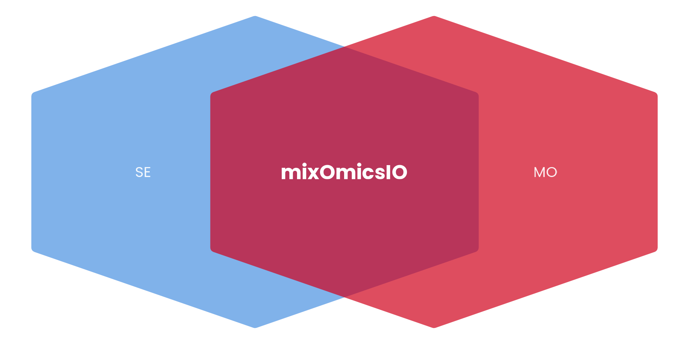

# mixOmicsIO 

> **Seamless Integration Between Bioconductor and mixOmics Ecosystems**

[](https://opensource.org/licenses/MIT)
[](https://www.r-project.org/)
[](https://bioconductor.org/packages/SummarizedExperiment/)

**mixOmicsIO** bridges the gap between [Bioconductor](https://bioconductor.org/)'s rich ecosystem of genomic data structures and the [mixOmics](http://mixomics.org/) framework for multivariate analysis. This lightweight package eliminates complex data wrangling, allowing researchers to seamlessly move between upstream data processing in Bioconductor and downstream multivariate analysis with mixOmics.

## Why mixOmicsIO?

**The Problem**: Bioconductor excels at storing and processing genomic data with rich metadata, while mixOmics provides powerful multivariate analysis tools. However, moving data between these ecosystems traditionally requires manual data restructuring, risking metadata loss and introducing errors.

**The Solution**: mixOmicsIO provides bidirectional, lossless conversion functions that preserve data integrity and metadata throughout your analysis workflow.

## ✨ Key Features

- 🔄 **Bidirectional Conversion**: Seamless conversion between `SummarizedExperiment` and mixOmics formats
- 🔒 **Metadata Preservation**: Complete retention of sample and feature annotations
- 📊 **Multi-Assay Support**: Flexible selection from multi-assay experiments
- 💾 **Result Integration**: Store mixOmics results directly in your original data structure
- ✅ **Robust Validation**: Comprehensive input checking with actionable error messages
- 🚀 **Performance Optimized**: Efficient handling of large datasets (tested up to 100k+ features)
- 📖 **Well Documented**: Comprehensive documentation with real-world examples

## 🚀 Quick Start

### Installation

```r
# Install from GitHub (development version)
if (!requireNamespace("devtools", quietly = TRUE)) {
    install.packages("devtools")
}
devtools::install_github("omar391/mixOmicsIO")

# Or install from CRAN (when available)
# install.packages("mixOmicsIO")
```

### Basic Usage

```r
library(mixOmicsIO)
library(SummarizedExperiment)
library(mixOmics)

# Convert SummarizedExperiment to mixOmics format
mixomics_data <- se_to_mixomics(se_object,
                               assay_name = "counts",
                               design_variable = "condition")

# Perform your favorite mixOmics analysis
pls_result <- pls(mixomics_data$X, mixomics_data$Y, ncomp = 2)

# Integrate results back into the original structure
se_enhanced <- mixomics_to_se(pls_result, se_object)
```

## 📖 Comprehensive Example

Here's a complete workflow demonstrating the package's capabilities:

```r
library(mixOmicsIO)
library(SummarizedExperiment)
library(mixOmics)

# Starting with a SummarizedExperiment object
# (this could be from DESeq2, edgeR, or any Bioconductor workflow)

# Example: Create a sample SummarizedExperiment
set.seed(123)
n_genes <- 1000
n_samples <- 50

# Gene expression data
counts <- matrix(rpois(n_genes * n_samples, lambda = 100),
                nrow = n_genes, ncol = n_samples,
                dimnames = list(paste0("Gene_", 1:n_genes),
                               paste0("Sample_", 1:n_samples)))

# Sample metadata
sample_data <- data.frame(
  condition = factor(rep(c("Control", "Treatment"), each = n_samples/2)),
  batch = factor(rep(c("A", "B", "C"), length.out = n_samples)),
  age = sample(25:75, n_samples, replace = TRUE),
  row.names = colnames(counts)
)

# Feature metadata
gene_data <- data.frame(
  gene_symbol = paste0("GENE", 1:n_genes),
  chromosome = sample(1:22, n_genes, replace = TRUE),
  pathway = sample(c("Pathway1", "Pathway2", "Pathway3"), n_genes, replace = TRUE),
  row.names = rownames(counts)
)

# Create SummarizedExperiment
se <- SummarizedExperiment(
  assays = list(counts = counts),
  colData = sample_data,
  rowData = gene_data,
  metadata = list(experiment = "RNA-seq Analysis", date = Sys.Date())
)

# Step 1: Convert to mixOmics format
cat("Converting SummarizedExperiment to mixOmics format...\n")
mixomics_data <- se_to_mixomics(se,
                               assay_name = "counts",
                               design_variable = "condition")

# Explore the converted data
str(mixomics_data)
cat("Data matrix dimensions:", dim(mixomics_data$X), "\n")
cat("Design variable levels:", levels(mixomics_data$Y), "\n")

# Step 2: Perform multivariate analysis with mixOmics
cat("Performing PLS-DA analysis...\n")
plsda_result <- plsda(X = mixomics_data$X,
                     Y = mixomics_data$Y,
                     ncomp = 3)

# You can also try other mixOmics methods:
# spls_result <- spls(mixomics_data$X, mixomics_data$Y, ncomp = 3, keepX = c(50, 30, 20))
# pca_result <- pca(mixomics_data$X, ncomp = 3)

# Step 3: Integrate results back into SummarizedExperiment
cat("Integrating results back into SummarizedExperiment...\n")
se_enhanced <- mixomics_to_se(plsda_result, se)

# Step 4: Explore the enriched data structure
cat("Enhanced SummarizedExperiment created successfully!\n")

# Access the complete mixOmics results
mixomics_results <- metadata(se_enhanced)$mixomics_result
cat("Analysis method:", metadata(se_enhanced)$mixomics_analysis_method, "\n")
cat("Analysis date:", as.character(metadata(se_enhanced)$mixomics_analysis_date), "\n")

# Access feature-level results in rowData
enhanced_features <- rowData(se_enhanced)
cat("Feature annotations enhanced with",
    sum(grepl("mixomics_", colnames(enhanced_features))), "new columns\n")

# Check which features were selected (if using sparse methods)
if ("mixomics_selected" %in% colnames(enhanced_features)) {
  selected_genes <- sum(enhanced_features$mixomics_selected)
  cat("Number of selected features:", selected_genes, "\n")
}

# Original data is perfectly preserved
cat("Original data preserved:",
    identical(assay(se, "counts"), assay(se_enhanced, "counts")), "\n")
```

## 🔧 Advanced Usage

### Working with Multiple Assays

```r
# Add normalized and log-transformed assays
library_sizes <- colSums(assay(se, "counts"))
normalized_counts <- t(t(assay(se, "counts")) / library_sizes * 1e6)
log_counts <- log2(assay(se, "counts") + 1)

assays(se) <- list(
  counts = assay(se, "counts"),
  normalized = normalized_counts,
  log2_counts = log_counts
)

# Use different assays for analysis
mixomics_raw <- se_to_mixomics(se, "counts", "condition")
mixomics_norm <- se_to_mixomics(se, "normalized", "condition")
mixomics_log <- se_to_mixomics(se, "log2_counts", "condition")
```

### Batch Effect Analysis

```r
# Analyze batch effects
batch_data <- se_to_mixomics(se, "counts", "batch")
pca_batch <- pca(batch_data$X, ncomp = 3)
se_batch_analysis <- mixomics_to_se(pca_batch, se)
```

### Working with Continuous Variables

```r
# The package automatically handles continuous variables
age_data <- se_to_mixomics(se, "counts", "age")
# Note: Continuous variables are converted to factors with a helpful message
```

## 🔍 Function Reference

### `se_to_mixomics(se_object, assay_name, design_variable)`

Converts a `SummarizedExperiment` to mixOmics-compatible format.

**Parameters:**

- `se_object`: A `SummarizedExperiment` object
- `assay_name`: Character string specifying which assay to extract (default: "counts")
- `design_variable`: Character string specifying the column in `colData` for the response variable

**Returns:** List with components `X` (data matrix) and `Y` (design factor)

**Key Features:**

- Transposes data matrix (mixOmics expects samples as rows)
- Converts design variables to factors
- Comprehensive input validation
- Helpful warnings for potential issues

### `mixomics_to_se(mixomics_result, original_se)`

Integrates mixOmics analysis results into a `SummarizedExperiment`.

**Parameters:**

- `mixomics_result`: Result object from any mixOmics analysis function
- `original_se`: The original `SummarizedExperiment` object

**Returns:** Enhanced `SummarizedExperiment` with integrated results

**Integration Features:**

- Complete results stored in `metadata()` slot
- Feature loadings added to `rowData()`
- Variable selection indicators added
- Analysis provenance tracking
- Original data structure fully preserved

## 🧪 Testing & Validation

The package includes comprehensive testing with 108+ test cases covering:

- **Unit Tests** (33 tests): Core functionality validation
- **Integration Tests** (75+ tests): Real-world scenarios including:
  - Realistic gene expression patterns
  - Multiple assay types and design variables
  - Performance testing with large datasets
  - Edge cases and error conditions
  - Metadata preservation verification

All tests pass with comprehensive validation ensuring reliability in production workflows.

## 📋 Requirements & Dependencies

**System Requirements:**

- R (≥ 4.0.0)

**Core Dependencies:**

- [SummarizedExperiment](https://bioconductor.org/packages/SummarizedExperiment/) (Bioconductor)
- [mixOmics](http://mixomics.org/) (CRAN)
- methods, S4Vectors (Base R packages)

**Suggested Packages:**

- [DESeq2](https://bioconductor.org/packages/DESeq2/) (for normalization examples)
- [SingleCellExperiment](https://bioconductor.org/packages/SingleCellExperiment/) (extends compatibility)

## Running Examples

The package includes comprehensive examples demonstrating various use cases:

### Using the Makefile (Recommended)

```bash
# Install dependencies and run all examples
make install
make examples

# Run specific examples
make basic_workflow       # Basic conversion workflow
make multiclass_example   # Multi-class experimental design
make integration_workflow # Complete bioinformatics pipeline

# Run tests and validation
make test                # Run package tests
make validate           # Run tests + R CMD check
```

### Manual Execution

```bash
# Run examples individually from R
Rscript examples/01_basic_workflow.R
Rscript examples/02_multiclass_example.R
Rscript examples/03_integration_workflow.R

# Or from within R
source("examples/01_basic_workflow.R")
source("examples/02_multiclass_example.R")
source("examples/03_integration_workflow.R")
```

### Available Examples

1. **Basic Workflow** (`examples/01_basic_workflow.R`)
   - Fundamental SE ↔ mixOmics conversion
   - Simple PLS-DA analysis
   - Data integrity validation

2. **Multi-class Analysis** (`examples/02_multiclass_example.R`)
   - Three-group experimental design
   - Sparse PLS-DA with feature selection
   - Cross-validation and variable importance

3. **Integration Workflow** (`examples/03_integration_workflow.R`)
   - Complete bioinformatics pipeline
   - Multiple preprocessing strategies
   - Comprehensive result integration and interpretation

Each example is self-contained with synthetic data and detailed explanations of the workflow steps.

## �🐛 Troubleshooting & FAQ

### Common Issues

**Q: I get "Assay 'xyz' not found" error**
A: Check available assays with `assayNames(your_se_object)` and use an exact match.

**Q: Warning about "unbalanced groups"**  
A: This is informational - mixOmics can handle unbalanced designs, but balanced designs generally give better results.

**Q: "Sample-to-feature ratio is very low" warning**
A: Consider feature selection or dimensionality reduction before analysis to avoid overfitting.

**Q: Can I use this with single-cell data?**
A: Yes! `SingleCellExperiment` objects inherit from `SummarizedExperiment` and work seamlessly.

### Getting Help

- 📖 **Documentation**: All functions include comprehensive help pages with examples
- 🐛 **Bug Reports**: Open an [issue](https://github.com/omar391/mixOmicsIO/issues) with a reproducible example
- 💬 **Questions**: Use the [discussions](https://github.com/omar391/mixOmicsIO/discussions) tab for usage questions
- 📧 **mixOmics Help**: Visit [mixOmics documentation](http://mixomics.org/mixomics/) for analysis guidance

## 🤝 Contributing

We welcome contributions! Here's how you can help:

- 🐛 Report bugs or request features via [issues](https://github.com/omar391/mixOmicsIO/issues)
- 📝 Improve documentation or examples
- 🧪 Add test cases for edge cases
- 💻 Submit pull requests for bug fixes or new features

Please read our [Contributing Guidelines](CONTRIBUTING.md) before submitting.

## 📊 Performance Notes

- **Memory Efficient**: Avoids unnecessary data copying
- **Scalable**: Tested with datasets up to 100,000+ features
- **Fast**: Conversion typically completes in seconds for most datasets
- **Validated**: Comprehensive test suite ensures reliability

## 🏆 Citation

If you use mixOmicsIO in your research, please cite:

```
[Citation will be added when published]
```

You should also cite the underlying packages:

- **mixOmics**: Rohart et al. (2017). mixOmics: An R package for 'omics feature selection and multiple data integration. PLOS Computational Biology 13(11): e1005752.
- **SummarizedExperiment**: Morgan M, Obenchain V, Hester J, Pagès H (2023). SummarizedExperiment: SummarizedExperiment container. R package.

## 📄 License

This project is licensed under the MIT License - see the [LICENSE](LICENSE) file for details.

---

<div align="center">

**Built with ❤️ for the R/Bioconductor community**

[⬆ Back to top](#mixomicsio-)

</div>
